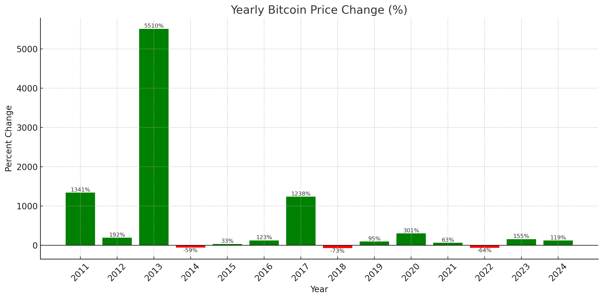

## 1.📊 Bitcoin Yearly Price Change (2011–2024)
This bar chart illustrates the annual percentage change in Bitcoin's opening price from January 1st to December 31st for each year between 2011 and 2024.

```sql
WITH first_price AS ( 
    SELECT DISTINCT
        EXTRACT(YEAR FROM timeopen) AS year,          
        open AS first_day_price                       
    FROM bicoin_historical_data
    WHERE EXTRACT(MONTH FROM timeopen) = 1            
      AND EXTRACT(DAY FROM timeopen) = 1              
      AND EXTRACT(YEAR FROM timeopen) <> 2025         
),
last_price AS (
    SELECT DISTINCT
        EXTRACT(YEAR FROM timeopen) AS year,          
        open AS last_day_price                        
    FROM bicoin_historical_data
    WHERE EXTRACT(MONTH FROM timeopen) = 12           
      AND EXTRACT(DAY FROM timeopen) = 31             
      AND EXTRACT(YEAR FROM timeopen) <> 2010         
)
SELECT
    fp.year,
    fp.first_day_price,
    lp.last_day_price,
    ROUND(((lp.last_day_price - fp.first_day_price) / fp.first_day_price) * 100, 2) AS percent_change,
    CASE 
        WHEN fp.first_day_price < lp.last_day_price THEN 'Profiteble year'
        ELSE 'Unprofitable year' 
    END AS category
FROM first_price fp
INNER JOIN last_price lp ON lp.year = fp.year      
```
Key Highlights:
- **2013** and **2017** stand out with explosive growth, showing gains of over **1000%** and **5000%**, respectively.
- **2014**, **2018**, and **2022** were significant down years, with losses exceeding **50%**.
- Despite short-term volatility, the overall long-term trend shows multiple strong recovery years.


*This visualization provides a quick view into Bitcoin's high volatility and long-term growth potential, helping contextualize both risk and reward in crypto investment across years.*

